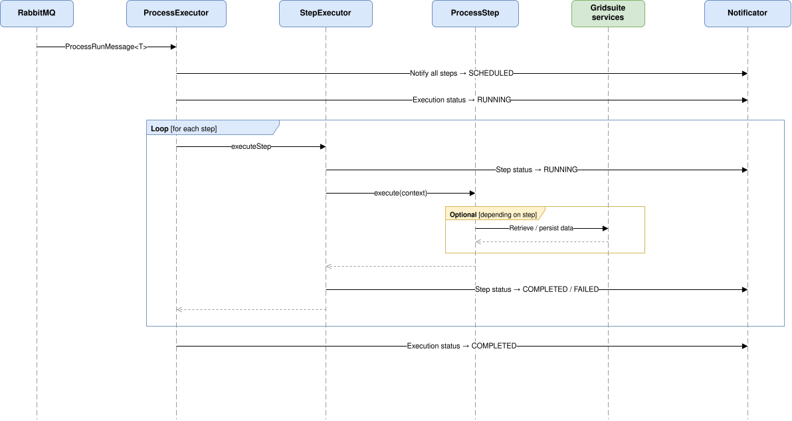

# Monitor worker server

## Presentation

Service dedicated to asynchronous computation execution.

It consumes RabbitMQ messages produced by `monitor-server`.

Responsibilities:

- execute PowSyBL computation pipelines, such as Load Flow and Security Analysis;
- chain processing steps;
- update execution statuses;
- produce and store results;
- handle debug mode by exporting intermediate files, such as XIIDM networks, and uploading artifacts to S3;
- support scalability by running multiple worker instances.

## Technologies

- Spring Boot
- Spring Cloud Stream / RabbitMQ
- PowSyBL
- AWS SDK S3

## Worker Configuration

`monitor-worker-server` contains the code needed to execute all process types.

There is no separate module by computation type: a single artifact is produced.

The process type handled by a worker is defined by the `worker.process` property in `application.yaml`:

```yaml
worker:
  process: securityanalysis
```

This property controls the RabbitMQ queue consumed by the worker:

```text
monitor.process.${worker.process}.run
```

To deploy several worker types, run several instances of the same artifact with different `worker.process` values.

## Properties

| Property | Default value | Description |
| --- | --- | --- |
| `worker.execution-env-name` | `default-env` | Name of the worker execution environment. |
| `worker.process` | `securityanalysis` | Process type handled by this worker instance. |

## Sequence diagram of a process execution


## Error Management

If a step throws an exception:

- the step status switches to `FAILED`;
- an error message is added to the `ReportNode`;
- the report is sent to `report-server`;
- remaining steps switch to `SKIPPED`;
- the execution status switches to `FAILED`;
- the exception is propagated after processing.
